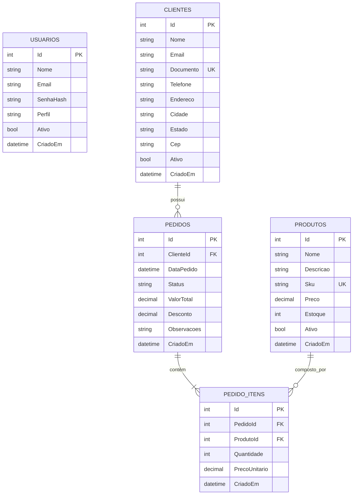

# 📊 Sistema de Gestão de Clientes e Pedidos (Full Stack)

[](https://dotnet.microsoft.com/)
[](https://learn.microsoft.com/aspnet/core)
[](https://learn.microsoft.com/ef/core)
[](https://www.microsoft.com/sql-server)
[](https://react.dev/)
[](https://www.typescriptlang.org/)
[](https://tailwindcss.com/)
[](https://www.docker.com/)

> Sistema corporativo completo para gestão comercial, controle de clientes, catálogo de produtos, emissão e fluxo de pedidos de venda com controle automático de estoque e dashboard executivo com indicadores em tempo real.

---

## 🎯 Objetivo do Projeto

Projeto desenvolvido para demonstrar domínio prático de padrões de arquitetura de software, desenvolvimento de **APIs RESTful de alta performance em C# / .NET 9**, modelagem de dados relacional com **Entity Framework Core e SQL Server**, autenticação stateless com **JWT Bearer**, interfaces ricas e reativas com **React + TypeScript**, testes unitários automatizados com **xUnit + Moq** e orquestração de microsserviços com **Docker & Docker Compose**.

---

## 🚀 Funcionalidades Principais

- 🔐 **Autenticação & Autorização JWT**:
  - Registro e autenticação de usuários com criptografia segura (`BCrypt`).
  - Geração de tokens JWT com expiração, validação de assinatura e claims de perfil.
  - Rotas protegidas tanto na API (Authorization Middleware) quanto no Front-end (Guards).

- 👥 **Gestão Completa de Clientes (CRUD)**:
  - Cadastro completo: Nome, Email, CPF/CNPJ, Telefone, Endereço e Status.
  - Busca textual em tempo real com debounce (por nome, documento ou contato).
  - Validação de formato de documento e restrição de exclusão para clientes com pedidos ativos.

- 📦 **Catálogo & Controle de Estoque de Produtos (CRUD)**:
  - Cadastro de itens com Código/SKU único, Preço e Quantidade em Estoque.
  - Identificação visual e alertas em tempo real de produtos com estoque crítico (< 5 unidades).

- 🛒 **Gestão de Pedidos & Faturamento**:
  - Emissão de pedidos com múltiplos itens e cálculo dinâmico de subtotais e descontos.
  - **Controle Transacional de Estoque**: Baixa automática no momento da criação da venda e estorno automático caso o pedido seja cancelado.
  - Ciclo de vida completo: `Pendente` ➔ `Processando` ➔ `Enviado` ➔ `Concluido` (ou `Cancelado`).
  - Modal com fatura detalhada e visão fiscal do pedido.

- 📈 **Dashboard Executivo em Tempo Real**:
  - Indicadores de faturamento total, vendas do mês vigente, volume de pedidos e taxa de clientes ativos.
  - Histórico de faturamento mensal dos últimos 6 meses.
  - Distribuição gráfica por status de pedido e ranking dos **Top 5 Clientes**.

- 🛡️ **Engenharia & Confiabilidade**:
  - Tratamento global de exceções formatado no padrão **RFC 7807 (ProblemDetails)**.
  - Feedback visual rico: Estados de *Loading*, *Empty State*, *Error State com Retry* e *Toasts temporários*.
  - Suíte com 13+ testes unitários automatizados cobrindo regras de negócio e serviços.

---

## 🏛️ Arquitetura do Sistema

O backend foi arquitetado seguindo o padrão em **Camadas Limpas (Layered Architecture)** com fluxo unidirecional:
**`Controller ➔ Service ➔ Repository ➔ Entity Framework Core ➔ SQL Server`**

```
gestao-clientes-pedidos/
├── backend/
│   ├── GestaoClientesPedidos.API/             # Controllers, Middlewares, Swagger, Configurações
│   ├── GestaoClientesPedidos.Core/            # Entidades, Enums, DTOs, Interfaces, Exceptions de Domínio
│   ├── GestaoClientesPedidos.Infrastructure/  # EF Core, AppDbContext, Repositórios, Serviços, Seeding
│   └── GestaoClientesPedidos.Tests/           # Testes unitários com xUnit + Moq + FluentAssertions
├── frontend/                                  # SPA React 18+ + TypeScript + Vite + Tailwind CSS
│   ├── src/
│   │   ├── components/ (common, layout)
│   │   ├── contexts/   (AuthContext)
│   │   ├── pages/      (Login, Register, Dashboard, Clientes, Produtos, Pedidos)
│   │   ├── services/   (Axios HTTP Client com Interceptors)
│   │   └── types/      (DTOs e Interfaces TS)
│   ├── Dockerfile
│   └── nginx.conf
├── docker-compose.yml                         # Backend (.NET 9) + Frontend (Nginx) + SQL Server 2022
├── .gitignore
└── README.md
```

---

## 🗄️ Modelo de Dados (Diagrama ER)



---

## 🔌 Principais Endpoints da API

A documentação interativa Swagger está disponível na raiz da API (`http://localhost:5000/`).

| Módulo | Método | Endpoint | Descrição | Autenticação |
|---|---|---|---|:---:|
| **Auth** | `POST` | `/api/auth/login` | Realiza login e gera token JWT | Pública |
| **Auth** | `POST` | `/api/auth/register` | Cria novo usuário no sistema | Pública |
| **Dashboard**| `GET` | `/api/dashboard/metrics` | Obtém métricas, faturamento e históricos | `Bearer JWT` |
| **Clientes** | `GET` | `/api/clientes` | Lista clientes paginados com filtro de busca | `Bearer JWT` |
| **Clientes** | `GET` | `/api/clientes/{id}` | Obtém detalhes de um cliente | `Bearer JWT` |
| **Clientes** | `POST`| `/api/clientes` | Cadastra um novo cliente | `Bearer JWT` |
| **Clientes** | `PUT` | `/api/clientes/{id}` | Atualiza dados do cliente | `Bearer JWT` |
| **Clientes** | `DELETE`| `/api/clientes/{id}` | Remove um cliente sem pedidos | `Bearer JWT` |
| **Produtos** | `GET` | `/api/produtos` | Lista catálogo com paginação e busca | `Bearer JWT` |
| **Produtos** | `GET` | `/api/produtos/estoque-critico` | Lista produtos com estoque < 5 un. | `Bearer JWT` |
| **Produtos** | `POST`| `/api/produtos` | Cadastra novo produto com SKU único | `Bearer JWT` |
| **Produtos** | `PUT` | `/api/produtos/{id}` | Atualiza preço, estoque e dados | `Bearer JWT` |
| **Produtos** | `DELETE`| `/api/produtos/{id}` | Remove produto do catálogo | `Bearer JWT` |
| **Pedidos**  | `GET` | `/api/pedidos` | Lista pedidos com filtro de status e cliente | `Bearer JWT` |
| **Pedidos**  | `GET` | `/api/pedidos/{id}` | Exibe detalhes fiscais e itens do pedido | `Bearer JWT` |
| **Pedidos**  | `POST`| `/api/pedidos` | Cria pedido com baixa de estoque | `Bearer JWT` |
| **Pedidos**  | `PATCH`| `/api/pedidos/{id}/status` | Altera status do pedido | `Bearer JWT` |
| **Pedidos**  | `DELETE`| `/api/pedidos/{id}` | Cancela pedido e estorna estoque | `Bearer JWT` |

---

## 🛠️ Como Executar o Projeto

### Opção 1: Via Docker Compose (Recomendado)

Suba toda a infraestrutura (SQL Server + API .NET 9 + Frontend React Nginx) com um único comando:

```bash
docker-compose up --build -d
```

Acesse os serviços:
- **Frontend SPA**: `http://localhost:3000`
- **Swagger / Backend API**: `http://localhost:5000`
- **SQL Server**: `localhost:1433` (`sa` / `Your_Strong_Password123!`)

---

### Opção 2: Execução Local (Desenvolvimento)

#### 1. Backend (.NET 9 API)
```bash
cd backend/GestaoClientesPedidos.API
dotnet run
```
*A API será iniciada em `http://localhost:5000` com banco em memória populado automaticamente (ou conectando ao SQL Server conforme appsettings.json).*

#### 2. Executar Testes Unitários
```bash
cd backend
dotnet test
```

#### 3. Frontend (React + Vite)
```bash
cd frontend
npm install
npm run dev
```
*O frontend iniciará em `http://localhost:5173`.*

---

## 🔑 Credenciais Padrão (Seed)

O banco de dados já inicializa pré-populado com dados para testes imediatos:

| Perfil | E-mail | Senha |
|---|---|---|
| **Administrador** | `admin@gestao.com` | `Admin@123456` |
| **Operador** | `operador@gestao.com` | `Operador@123456` |

---

## 💡 Decisões Técnicas e Boas Práticas

1. **Repository Pattern & Generic Repository**: Desacoplamento da camada de acesso a dados (ORM) da lógica de negócios, facilitando a testabilidade com mocks em memória.
2. **DTO (Data Transfer Object) Pattern**: Blindagem das entidades de banco de dados, impedindo *over-posting* e serialização de dados sensíveis (ex: hashes de senha).
3. **Tratamento Global de Exceções**: Middleware centralizado que padroniza todas as respostas de erro HTTP (400, 401, 404, 422, 500) com mensagens amigáveis.
4. **Validação de Estoque Transacional**: Antes da confirmação do pedido, verifica-se a disponibilidade real dos produtos; em caso de cancelamento posterior, os itens são devolvidos com precisão ao inventário.
5. **Debounce em Buscas no Frontend**: Otimização de requisições de rede evitando chamadas redundantes a cada tecla digitada pelo usuário.
6. **Contêineres Multi-Stage**: Imagens Docker otimizadas, leves e seguras, separando o ambiente de compilação/SDK do ambiente de execução/runtime enxuto.

---

## 👨‍💻 Autor

Desenvolvido por **Levy Dev** — Engenheiro de Software Full Stack.  
Focado em desenvolvimento de soluções escaláveis em **C# / .NET**, **SQL Server** e **React**.
